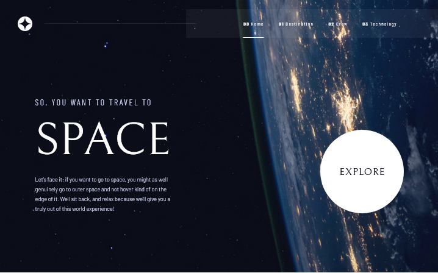
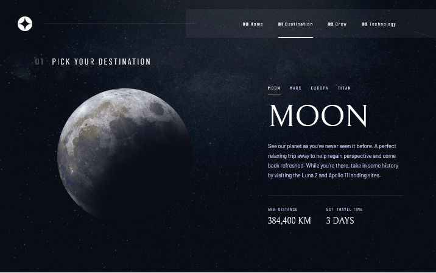
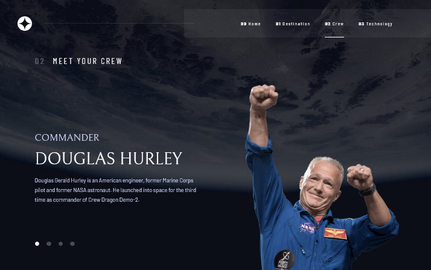
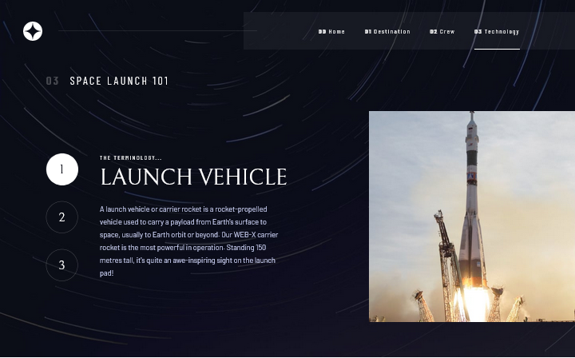

# Frontend Mentor - Space tourism website solution

This is a solution to the [Space tourism website challenge on Frontend Mentor](https://www.frontendmentor.io/challenges/space-tourism-multipage-website-gRWj1URZ3).
## Table of contents

- [Overview](#overview)
  - [The challenge](#the-challenge)
  - [Screenshot](#screenshot)
  - [Links](#links)
- [My process](#my-process)
  - [Built with](#built-with)
  - [What I learned](#what-i-learned)
  - [Continued development](#continued-development)
  - [Useful resources](#useful-resources)
- [Author](#author)
- [Acknowledgments](#acknowledgments)

## Overview

### The challenge

Users should be able to:

- View the optimal layout for each of the website's pages depending on their device's screen size
- See hover states for all interactive elements on the page
- View each page and be able to toggle between the tabs to see new information

### Screenshot









### Links

- Solution URL: [Git Link](https://github.com/Cross-companion/space-tourism-app)
- Live Site URL: [Live Site](https://space-tourism-app-omega.vercel.app)

## My process

### Built with

- Semantic HTML5 markup
- CSS custom properties
- Flexbox
- Sass
- Desktop-first workflow
- Vanilla Javascript

### What I learned
While Building This Project, I focused strengthening my SASS and css Flexbox skills, so I made use of alot of them. Plus Every Page's content(Except the main Navigation at the top) is entirely source from a local Json database Using Javascript. Here is how my main tag Looks Like😁😅

```html
<main>
    <!-- CODE FROM JS GOES HERE -->
 </main>
```
Plus I use Mixins to Handle all responsiveness, Here is a small snippet:
```scss
@mixin respond($breakpoint) {
  @if $breakpoint == mainTab {
    @media screen and (max-width: 56.25em) {
      @content;
    }
  }
}
```
I use the MVC architechture for t=my Javascript

### Continued development

Going on From Here, I would continue my Learning learnings with React and Next.js to complete my MERN stack goal. 


## Author

- Website - Nwodoh Daniel
- Frontend Mentor - [@Cross-companion](https://www.frontendmentor.io/profile/Cross-companion)
- Twitter - [@Cross_companion](https://www.twitter.com/Cross_companion)

